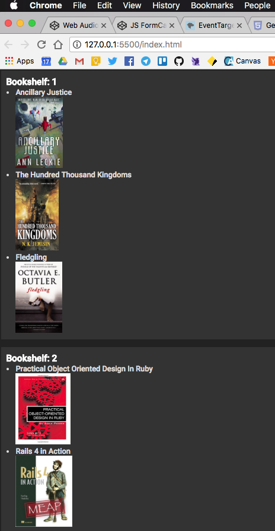

# js 'Promise' based JSON bookshelf

Exercise for my Coder Academy bootcamp. Messy, hacky, comment-riddled code for the sake of learning. First time using JS to "fetch" and return a 'Promise'- We set up a simple "Books" JSON server and requested to it using 'fetch' in JS.

After that, worked with the DOM to display it in the view. Added a few divs, messed with ID assignment and the like. Is fun!

#### Workaround for those cloning:

I've added some books to a books.json file and just had the page pull them in directly for now, bypassing the "promise" "fetch" by default. I left the code in there for the fetch, though:

**If you'd like to use 'fetch' to populate it with your own books:** 

- Make sure the books object is an array of books, with "title" in there somewhere. I don't display anything else, for now. 
- Call "getBooks" with your books URI (full URI ie "http://localhost:3000/books/")

If not, it'll use "getJson" to populate from the JSON object :)